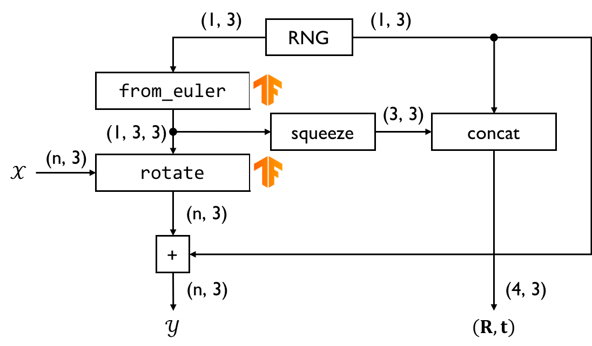
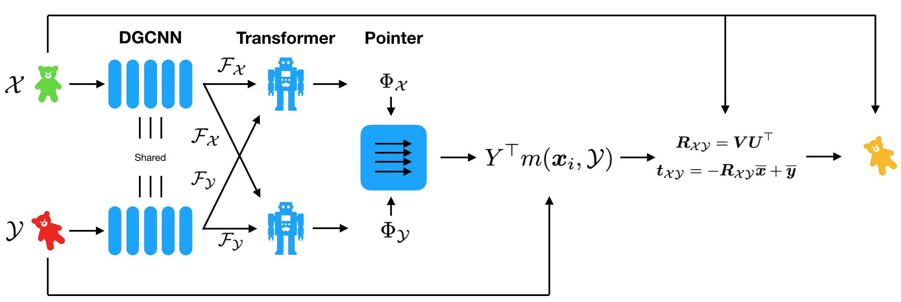
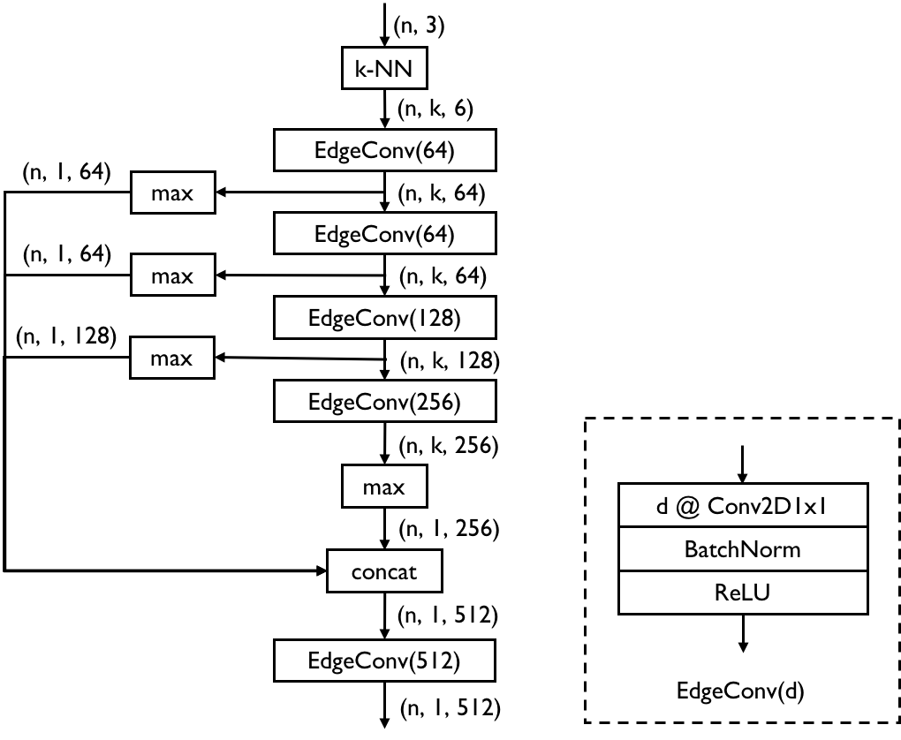
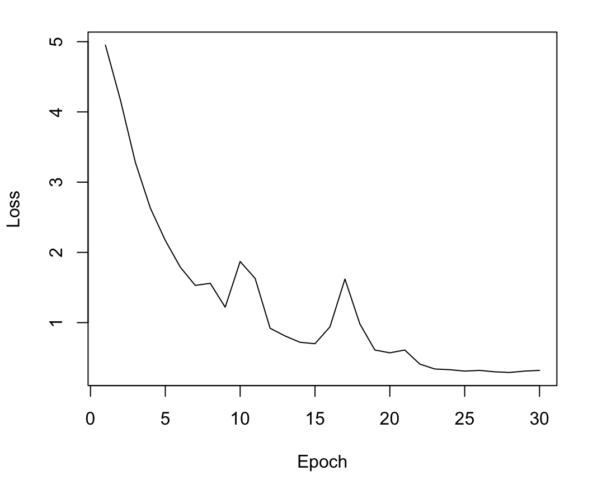

# GPU 计算及深度学习 大作业报告

###### 王梓涵　517021911179

## 简介

本项目使用 TensorFlow 实现了神经网络模型 [Deep Closest Point](https://arxiv.org/abs/1905.03304) 以求解点云配准问题，使用 [TensorFlow Graphics](https://tensorflow.google.cn/graphics) 生成点云的刚体变换。

## 实现

### 生成数据

本项目中的原始模型来自现有的数据集，而刚体变换数据以及变换后的点云数据则需要自行生成。由于神经网络中数据是分批输入的，数据的生成也是按照批为单位进行。这里采用的是随机的生成策略，即对于每一批中的每一个点云模型，都单独为其生成一组随机的刚体变换，同时计算变换后的模型。刚体变换和变换后的模型只在其被需要的时候生成，在内存中并不作长久保留。这样保证了在每一轮训练/测试中，每个模型的变换都是不同的。这一方法使得数据大大增强，基本消除了模型出现过拟合的可能。

在具体实现中，通过重载 Keras 中的 `Sequence` 类来组织数据，具体的生成过程通过重写 `__getitem__()` 方法来实现。以下假设一批源点云数据的张量形状为 `(batch_size, num_points, 3)`，省略批量大小，则为 `(num_points, 3)`。一个刚体变换具有六个自由度，旋转及平移各三个。首先使用 NumPy 为每个模型生成三个 $[-\pi,\pi]$ 之间的随机数作为欧拉角的三个分量 $(h,p,r)$，形状为 `(1, 3)`。使用 TFG 中的 `rotation_matrix_3d.from_euler()` 将欧拉角转为旋转变换矩阵，形状为 `(1, 3, 3)`。使用 TFG 中的 `rotation_matrix_3d.rotate()` 对源点云进行旋转变换。再为每个模型生成三个 $[-0.5,0.5]$ 之间的随机数作为平移分量，形状为 `(1, 3)`。将之与变换后的点云做加法运算，即可得到变换后的目标点云，形状与源点云相同。

在生成所有数据后，需要对数据进行重新组织，使其适合作为模型输入。模型的输入包含源点云和目标点云，所以将这两组数据分别在第一维上扩展，然后在该维上连接，形状为 `(2, num_points, 3)`。模型的输出为刚体变换，本项目中采取的方法是将旋转分量的第二维挤压，然后将其与平移分量在第二维上连接，形状为 `(4, 3)`。这一组织方式不符合常规的齐次变换矩阵，但其构造方式更加直接。整个数据生成流程如下图所示：

### 构建模型

DCP 模型较为复杂，包含了三个主要的模块：负责特征提取的 DGCNN，负责序列匹配的 Transformer，以及基于奇异值分解（SVD）的刚体变换生成模块，这些模块的关系如下图所示。DCP 论文的作者提供了 [PyTorch 实现](https://github.com/WangYueFt/dcp)。本节仅对各模块中的实现要点，主要是那些和原实现中不同之处进行解释，不会覆盖所有模型的细节。

#### DGCNN

DGCNN 全称为动态图卷积神经网络（Dynamic Graph CNN）。该模型将点云数据建模为图，对于点云中的每个点（即图中的每个顶点），将其与该点的 k 近邻点相连作为图的边，通过边卷积（EdgeConv）来提取各点的特征。该模型中使用的 DGCNN 在原始模型的基础上作出了一些修改，其结构如下图所示。所有张量形状的第一维，即 `batch_size` 均已省略，本节中其余内容也遵循这一习惯。

该模块中 k 近邻的计算需要自行定义，是该实现模块的技术要点。对于张量形状为 `(n, 3)` 的原始点云数据，通过矩阵乘法、平方以及在最后一维上的求和等运算，生成距离矩阵（表示各点到其余所有点的距离），形状为 `(n, n)`。使用 `tf.nn.topk` 作用于距离矩阵，来找到对于每个点而言最近的那些点的序号，形状为 `(n, k)`。再使用 `tf.gather` 收集这些点的坐标，形状为 `(n, k, 3)`。将原始点云数据的扩展一维为 `(n, 1, 3)`，在该维上重复 `k` 遍，再与之前收集过的近邻点坐标在最后一维连接，得到 k 近邻的特征数据，形状为 `(n, k, 6)`。

#### Transformer

Transformer 是一种可以完成序列到序列（Seq2Seq）任务的模型，在机器翻译等自然语言处理任务中广泛应用。而点云配准中将源点云和目标点云的点进行匹配，与机器翻译中从源语言到目标语言的匹配是可以类比的，这就是其能够跨界的原因。在 DCP 中，该模型用来使点云特征更加任务特有，以提高匹配的质量。Transformer 在 [TensorFlow 官方教程](https://tensorflow.google.cn/tutorials/text/transformer) 中已有完整实现，这里不再赘述。要注意不能引入位置编码，因为点云是无序的，每个点的特征中不能包含其在点列表中的序号。

#### SVD 模块

DCP 模型中在 Transformer 模块之后的剩余所有部分，通过源点云和目标点云的位置及其特征来生成最终的刚体变换，本项目中将其作为一个单独的模块。该模块包含两个部分，一个部分是根据源点云和目标点云的特征来计算软指针矩阵，即点的对应关系，第二部分则是使用 SVD 求出旋转变换矩阵，进而求出平移。这一模块里的计算都比较常规，只要遵循论文中的公式即可完成。

## 实验

### 训练与测试

本项目的训练和测试数据和论文中同样采用 [ModelNet40](https://shapenet.cs.stanford.edu/media/modelnet40_ply_hdf5_2048.zip) 数据集。该数据中集中包含 9468 个训练模型，2468 个测试模型，每个模型内包含 2048 个三维坐标点。

训练所使用的损失函数使用的是 $\mathrm{SE}(3)$ 刚体变换空间上的平方距离，其中带上标 $^g$ 的参数为真实值：
$$
L=||\mathbf{R}^\mathsf{T}_\mathcal{XY}\mathbf{R}^g_\mathcal{XY}-I||^2+||\mathbf{t}_\mathcal{XY}-\mathbf{t}^g_\mathcal{XY}||^2
$$
模型的度量标准同样采用该函数，因为在真实的刚体变换已知的情况下，该式的计算十分快速，也足以表示配准的准确程度。而对于点云配准的原始定义，其计算较为复杂，不适合高效地评价模型的能力。

该模型结构较为复杂，层数多。虽然总参数量不大，但如果从完全随机的初始参数开始训练，容易出现不能收敛的情况。因此，在训练前预载入了 DCP 作者提供部分训练参数，载入的参数包括所有卷积层和全连接层的参数。训练使用 Adam 优化器，前 20 轮学习率为 $1\times10^{-4}$，后 10 轮的学习率为 $1\times10^{-5}$。在 NVIDIA Tesla V100 上进行训练，批量大小为 16，训练共耗时 3 小时 32 分钟，训练过程如下图所示：

训练过程中的最低损失为 0.287，保留此状态下的模型参数进行测试，损失为 0.264。说明该模型具有很好的泛化能力，没有出现过拟合的现象。

### 比较

这里将 DCP 分别与三个具有代表性的传统算法进行比较。ICP 是经典的使用迭代方法进行配准的算法，4-PCS 是一种基于随机采样一致性（RANSAC）的算法，Go-ICP 是基于 ICP 及分支限界的算法。ICP 及 4-PCS 算法采用的是 [PCL](https://pointclouds.org/) 中的默认实现。[Go-ICP](https://github.com/wzh99/OptICP) 是本人在先前项目中与他人合作实现的，在原论文作者实现的基础上了进行了性能优化。

测试数据为 ModelNet40 测试集的前 100 个模型。由于 DCP 使用 Python 实现，其余算法使用 C++ 实现。为了保证不同环境下所生成数据的一致性，规定 C++ 的测试程序中使用和 NumPy 相同的 MT19937 随机数生成算法，初始种子均设为 1。

实验中将上述算法分别在准确性（即损失函数）以及平均配准耗时上进行比较，DCP 分别在 CPU 和 GPU 上运行，其余算法只能在 CPU 上运行。本实验中采用的 CPU 为 Intel Core i5 7500，GPU 为 NVIDIA GeForce RTX 2070。测试结果如下：

| 方法     | 损失函数 | 耗时（秒） |
| -------- | -------- | ---------- |
| DCP(CPU) | 0.193    | 0.670      |
| DCP(GPU) | 0.193    | 0.031      |
| ICP      | 6.066    | 0.027      |
| 4-PCS    | 6.132    | 0.077      |
| Go-ICP   | 1.534    | 2.384      |

可以观察到就准确性而言 DCP 不仅大大优于 ICP 和 4-PCS，而且也比号称能找到全局最优解的 Go-ICP 准确性更好。就算法整体的运算量而言（比较 CPU 上的耗时），DCP 比 ICP 和 4-PCS 大得多，但仍小于 Go-ICP。DCP 作为深度学习模型，可以通过相关框架的支持运行在 GPU 上，此时其耗时则和 ICP 相仿。这说明 DCP 的整体性能，相比传统算法是十分突出的。